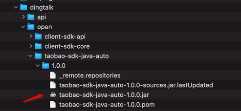

## Spring Cloud Alibaba微服务架构实战派源码说明

------

### 1. 从百度网盘下载源码（后面会开放到gitee或者github）

### 2. 源码编译帮助

- 将源码中的钉钉客户端Jar包下载到本地，路径spring-cloud-alibaba-practice-master/taobao-sdk-java-auto-1.0.0.jar；
- 执行命令如下命令，将Jar包安装到本地Maven仓库

```java
mvn install:install-file -DgroupId=com.dingtalk.open -DartifactId=taobao-sdk-java-auto -Dversion=1.0.0 -Dpackaging=jar -Dfile=/Users/huxian/Downloads/taobao-sdk-java-auto-1.0.0.jar
```



### 3. 使用Maven打包命令，重新编译源码

源码已经去掉了target目录下的jar包，方便大家下载

```java
mvn clean install -Dmaven.test.skip=true
```

### 4. 执行SQL语句（数据库类型为MySQL）
    直接执行spring-cloud-alibaba-practice/spring_cloud_alibaba_practice.sql语句
    另外与Nacos Sync和 Datax Web相关的SQL也放在根目录中了
### 5. 说明

本书是偏实战性的书籍，需要大家自己动起来，这样才能体现本书的价值，希望大家能够学习愉快。

可以关注本人维护的技术干货公众号，后续会有很多推文，谢谢

